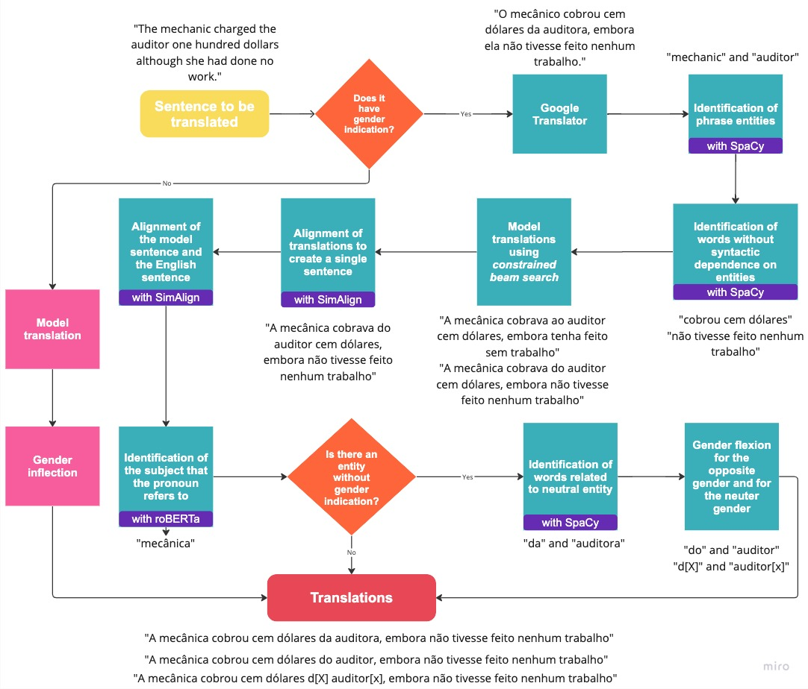
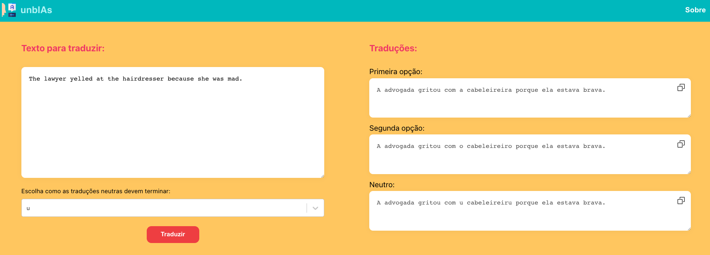
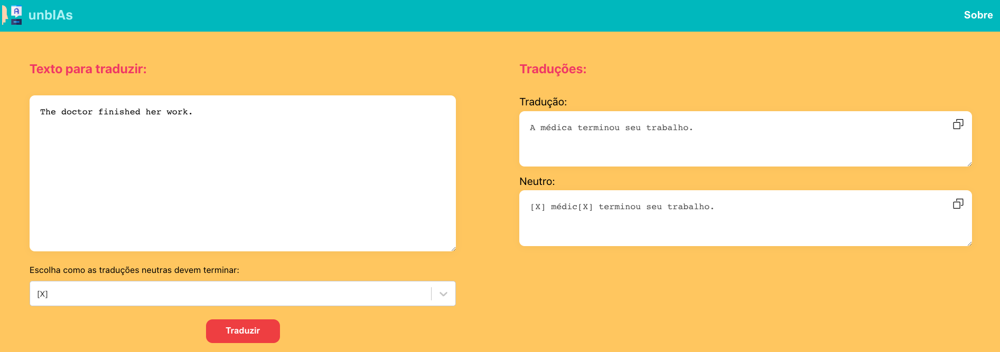
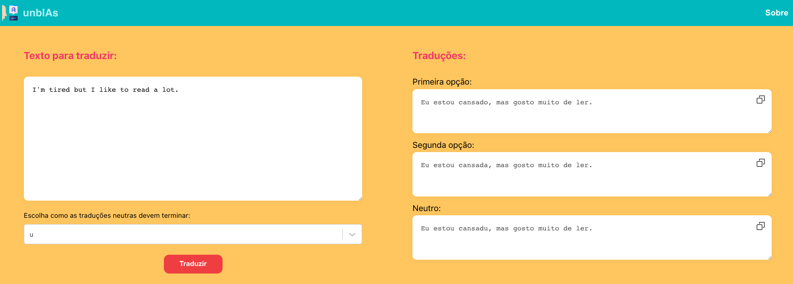

# unbIAs: Enhancing Gender Accuracy in Machine Translation

## Overview

The unbIAs project introduces a model designed to achieve high gender accuracy in machine translation. Leveraging advanced linguistic analysis with spaCy and entity recognition with RoBERTa, this model utilizes Constrained Beam Search to maintain the syntactical structure of sentences derived from commercial models while substituting the correct gender as identified by our model. The final output is refined using the SimAlign tool.

This approach has achieved a BLEU score of 48.39. Compared to Google Translate, our model has improved gender accuracy from 68.75 to 70.09, a 15.7% improvement in gender entity accuracy disparity between male and female entities, and a 43% reduction in stereotypical translations.

## System Pipeline

Here is the pipeline diagram showing how the unbIAs system processes translations to ensure gender accuracy:



## Application Screenshots

### Translation Interface

The unbIAs application provides a user-friendly interface for inputting text and displaying gender-accurate translations. Here are some examples of the interface in action:

#### Example 1: Lawyer and Hairdresser

This figure shows the user interface of the unbIAs translation tool, where users can input a sentence and receive translations in feminine, masculine, and neutral forms keeping the correct gender for the entitity with the gender indication. The example sentence "The lawyer yelled at the hairdresser because she was mad" is translated to "A advogada gritou com a cabeleireira porque ela estava brava" (feminine), "A advogada gritou com o cabeleireiro porque ela estava brava" (masculine), and "A advogada gritou com u cabeleireiru porque ela estava brava" (neutral).



#### Example 2: Doctor Finishing Work

This figure shows the translation outputs for a sentence with gender indication for all entities using the unbIAs tool. The sentence "The doctor finished her work" is translated into "A médica terminou seu trabalho" (feminine) and "[X] médic[X] terminou seu trabalho" (neutral).



#### Example 3: Neutral Gender Option

This figure shows the translation outputs for a gender-neutral sentence using the unbIAs tool. The sentence "I'm tired but I like to read a lot" is translated into "Eu estou cansado, mas gosto muito de ler" (masculine), "Eu estou cansada, mas gosto muito de ler" (feminine), and "Eu estou cansadu, mas gosto muito de ler" (neutral).



## Usage

The unbIAs project is divided into two main components: the API, built with Python 3.8, and the application, developed with React. To utilize this project, follow these installation steps:

1. Install dependencies:

   ```bash
   ./install.sh
   ```

2. Inside the `APP` directory, install the necessary packages:

   ```bash
   npm install
   ```

3. To run the project, navigate to the `API` directory and execute:

   ```bash
   flask run -p 8000
   ```

4. In the APP directory, start the application:
   ```bash
   npm start
   ```
   The project will be accessible at http://localhost:3000/.

## License

This project uses the following license: [MIT](https://github.com/ramos-ai/unbIAs?tab=MIT-1-ov-file).
